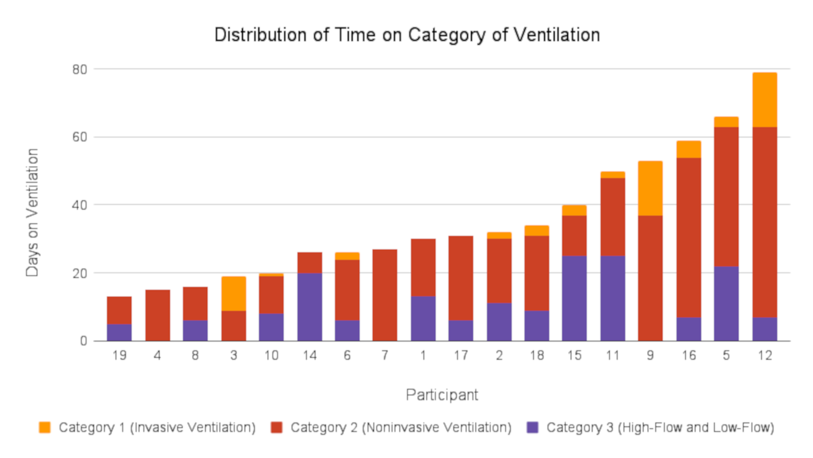

```{r libraries}
#| label: load-packages
#| include: false
library(tidyverse)
library(gtsummary)
library(flextable)
library(ftExtra)
```

```{r}
load("./notebooks/results.RData")
```

^\*^ Joint senior authors

**Keywords:** cerebral metabolic rate of oxygen; cerebral blood flow; ventilation; preterm; respiratory support; arterial spin labeling; quantitative susceptibility mapping

**Wordcount:** 4,864

---

**ABBREVIATIONS:** 
ASL = arterial spin labeling; 
CMRO~2~ = cerebral metabolic rate of oxygen;
CSaO~2~ = cerebral arterial oxygen saturation;
CSvO~2~ = cerebral venous oxygen saturation;
GA = gestational age;
CGM = cortical grey matter;
DGM = deep grey matter;
Hct = hematocrit;
NICU = neonatal intensive care unit;
NIRS = near-infrared spectroscopy;
OEF = oxygen extraction fraction;
PMA = post-menstrual age;
PPM = parts per million;
QSM = quantitative susceptibility mapping;
T~2~-TRIR = T~2~ Prepared Tissue Relaxation Inversion Recovery; 
TRUST = T~2~-relaxation-under-spin-tagging;

::: {.content-hidden}
# Summary Section

**PREVIOUS LITERATURE:** <!-- 100 words --> Quantitative estimates of brain oxygen consumption can be achieved using oxygen-15 PET or xenon clearance techniques, which measure cerebral blood flow but are invasive and involve ionizing radiation, limiting their use in neonates. A less invasive option is near-infrared spectroscopy (NIRS), which estimates cerebral venous oxygen saturation (CSvO~2~) but is limited to single-region assessments and superficial brain tissue. Non-invasive MRI techniques have been explored, including venous oxygenation measurements with TRUST MRI, MR susceptometry, and T~2~-TRIR MRI pulse sequences, showing feasibility in neonates and correlating well with previous methods.

**KEY FINDINGS:** <!-- 50 words --> Using a novel, non-invasive MRI technique and analysis pipeline, CBF and CMRO~2~ values were measured in very preterm neonates at TEA and found to align closely with reference values. CBF and CMRO~2~ values were associated with time in room air and non-invasive ventilation.

**KNOWLEDGE ADVANCEMENT:** <!-- 50 words --> We introduced a novel MRI technique and analysis pipeline, and demonstrated that non-invasive respiratory support in very preterm infants is associated with increased cerebral oxygenation and consumption, while room air is linked to lower values. Semi-regional brain analysis revealed that respiratory support impacts different brain structures uniquely.

# Graphical Abstract

This study presents a novel multi-modal MRI approach to measure cerebral blood flow (CBF) and oxygen metabolism (CMRO~2~) in preterm infants. Findings suggest non-invasive respiratory support is associated with higher CBF and CMRO~2~, highlighting its potential impact on neonatal brain oxygenation and development.
:::



# Abstract <!-- max 350 words -->

**BACKGROUND AND PURPOSE:** Developing a non-invasive method for measuring oxygen consumption at both regional and whole-brain levels in preterm infants is crucial for assessing brain development and neuronal injury in this vulnerable population. This study presents a multi-modal MRI technique and analysis pipeline that produces whole-brain semi-regional maps - with the potential to be fully regional - which we employ in a cohort study to investigate how the duration of various respiratory supports in very preterm infants affects CBF and the cerebral metabolic rate of oxygen (CMRO~2~).

**METHODS:** Infants (n = 19) born < 32 weeks gestational age were recruited in the neonatal intensive care unit. Infants were scanned at term-equivalent age using a 3T MRI sequence comprising of T~1~-weighted, T~2~-weighted, arterial spin labeling (ASL), and SWI. Days on three different categories of respiratory support, based on levels of invasiveness, were recorded. Using multiple linear regression, CBF and CMRO~2~ were analyzed against days on: respiratory support, days in room air, and the proportion of days on respiratory support; GA and PMA were used as confounding factors.

**RESULTS:** Average CBF and CMRO~2~ of cortical grey matter was `r round(allstats["GM_CBF","mean"],2)` ± `r round(allstats["GM_CBF","sd"],2)` mL / 100 g / min and `r round(allstats["GM_CMRO2","mean"],2)` ± `r round(allstats["GM_CMRO2","mean"],2)` µmol / 100 g / min, respectively. CMRO~2~ and CBF were positively correlated with days on non-invasive respiratory support, and negatively correlated with days in room air.

**CONCLUSION:** Using our novel method, CBF and CMRO~2~ values aligned closely with literature values. Our exploratory findings suggest that the type of respiratory support may influence cerebral oxygenation during the neonatal period in infants born very preterm, with greater oxygen delivery and consumption associated with non-invasive respiratory support. Our semi-regional brain analysis further highlights that different brain structures are impacted in distinct ways.

# Introduction {#sec-intro}

The developing brains of preterm infants are vulnerable to injury and dysmaturation, which can result in long-term neurological deficits [@kiechl-kohlendorferAdverseNeurodevelopmentalOutcome2009]. Infants born very preterm (≤ 32 weeks gestation) are particularly at risk for significant short and long-term respiratory problems, and the lower the gestational age at birth, the more likely the infant may be negatively impacted [@chungNeurodevelopmentalOutcomesPreterm2020]. To mitigate these risks, it is crucial to monitor brain hemodynamics, as instability in oxygen delivery and metabolism can contribute to these injuries [@dhillonCerebralOxygenationMetabolism2022]. These infants are also at significant risk of respiratory disorders, such as respiratory distress syndrome [@mcphersonPreventionTreatmentRespiratory2018], and bronchopulmonary dysplasia [@yoderHighfrequencyVentilationNoninvasive2016]. Finding ways to prevent these respiratory disorders, and support lung development, is critically important as lung health helps determine the amount of oxygen the brain receives [@cannavoVentilationOxidativeStress2020 ;@guillotMechanicalVentilationDuration2020]. Therefore, close monitoring of cerebral oxygenation is critical to identify these risks early and apply neuroprotective strategies that may mitigate long-term neurological consequences.

In the NICU, to aid in respiration and improve lung function, various strategies including different forms of ventilation can be used, where the general goal is to decrease days of invasive mechanical ventilation. Non-invasive modes of ventilation, such as continuous positive airway pressure and nasal intermittent positive pressure ventilation, have been shown to be effective in lowering rates of complications and mortality compared to intubation with mechanical ventilation [@kalikkotthekkeveeduVentilationInducedLungInjury2022; @hoContinuousPositiveAirway2020; @ackermannHighfrequencyVentilationPreterm2023; @shiProspectiveRandomizedControlled2014]. With advances in neonatal intensive care and the use of less invasive forms of respiratory support, the incidence of bronchopulmonary dysplasia and other respiratory complications in preterm neonates has decreased over time [@dumpaNonInvasiveVentilatoryStrategies2021]. However, the optimal mode and timing of ventilation in preterm neonates with respiratory disorders are still being debated [@brownMechanicalVentilationPremature2011; @greenoughOptimalStrategiesNewborn2005; @ramaswamyEfficacyNoninvasiveRespiratory2020; @kollisch-singuleMechanicalVentilationPediatric2022]

<!-- Quantitative estimates of brain oxygen consumption can be achieved using oxygen-15 PET [@mintunBrainOxygenUtilization1984]. Alternatively, xenon clearance technique measures cerebral blood flow, providing an indirect assessment of brain oxygen consumption by evaluating oxygenation in the jugular vein [@prydsCarbonDioxideRelatedChanges1990]. However, both methods are invasive, requiring ionizing radiation, which limits their suitability for neonates. A less invasive option for evaluating brain hemodynamics is near-infrared spectroscopy (NIRS), which uses the attenuation of near-infrared light (~650–950 nm) as it passes through biological tissue [@skovEstimationCerebralVenous1993]. Deoxygenated and oxygenated hemoglobin absorb this light differently, allowing NIRS to estimate changes in deoxyhemoglobin and oxyhemoglobin [@wrayCharacterizationInfraredAbsorption1988] and thus provide an estimate of cerebral venous oxygen saturation (CSvO~2~). While NIRS offers the advantage of being non-invasive and continuous bedside monitoring, it is limited to regional assessments where the probe is placed and is sensitive only to superficial brain tissue due to the shallow penetration depth of near-infrared light [@boasDiffuseOpticalImaging2004]. -->

Non-invasive MRI-based techniques are actively being explored to assess whole-brain oxygen consumption. One approach combines non-invasive venous oxygenation measurements from the sagittal sinus using T~2~-relaxation-under-spin-tagging magnetic resonance imaging (TRUST [@luQuantitativeEvaluationOxygenation2008]) with flow measurements from phase-contrast MR angiography, which has been used in adults [@xuNoninvasiveQuantificationWholebrain2009] and has shown feasibility in neonates [@liuQuantitativeAssessmentGlobal2014; @qiHemodynamicMetabolicAssessment2018]. Another method combines MR susceptometry to measure venous oxygenation in the sagittal sinus with phase-contrast MR angiography [@jainRapidMagneticResonance2011]. Studies using these techniques in neonates demonstrated that the results correlate well with those obtained through diffuse optical and correlation spectroscopy methods [@jainCerebralOxygenMetabolism2014]. Still another method applied in neonates is the T~2~ prepared tissue relaxation inversion recovery (T~2~-TRIR) MRI pulse sequence [@petersenModelfreeArterialSpin2006], which measures the transverse and longitudinal relaxation rate of blood (T~2b~ and T~1b~) in the sagittal sinus, and venous oxygenation subsequently derived from the T~2b~ and the T~1b~-derived hematocrit [@luCalibrationValidationTRUST2012].

In the current study, we propose a new method using quantitative susceptibility mapping (QSM) and arterial spin labeling (ASL) – in combination with hematocrit (Hct) and pulse oximetry – to determine whole-brain semi-regional cerebral metabolic rate of oxygen (CMRO~2~) and regional CBF. In order to investigate the validity of this new non-invasive approach we compared the obtained results to previously reported reference values [@altmanCerebralOxygenMetabolism1993; @devisNoninvasiveMRIMeasurements2014; @liuQuantitativeAssessmentGlobal2014; @elwellMeasurementCMRO2Neonates2005; @skovEstimationCerebralVenous1993; @yoxallMeasurementCerebralOxygen1998; @qiHemodynamicMetabolicAssessment2018]. In addition, we conducted an exploratory analysis to evaluate if the technique can detect whether the degree of lung disease, as indicated by the duration of time on different levels of respiratory support in very-preterm neonates, is correlated with brain oxygenation measures CMRO~2~ and CBF in different brain regions at term-equivalent age. We hypothesized the CMRO~2~ and CBF would be negatively correlated with time on invasive respiratory support.

# Methods

## STROBE

The methodology and its reporting have followed the STrengthening the Reporting of OBservational studies in Epidemiology (STROBE) standards. We include the checklist for a cohort study in our Supplementary Materials.

## Patients

The study was approved by the Clinical Research Ethics Board at the <!-- University of British Columbia and Children's & Women's Hospital (H21-00655) --> *** and written informed consent was obtained from the parent/guardian for each infant.

Preterm neonates born < 32 weeks gestational age (GA) (n=20) admitted to the level III neonatal intensive care unit (NICU) at <!-- BC Women’s Hospital (BCWH) --> *** in <!-- Vancouver Canada --> *** were recruited by a research nurse from February 2021 to January 2022. Our sample size was determined based on similar recruitment numbers from previous studies [@altmanCerebralOxygenMetabolism1993; @devisNoninvasiveMRIMeasurements2014; @liuQuantitativeAssessmentGlobal2014; @elwellMeasurementCMRO2Neonates2005; @skovEstimationCerebralVenous1993; @yoxallMeasurementCerebralOxygen1998; @qiHemodynamicMetabolicAssessment2018]. Inclusion criteria were infants born less than 32 weeks GA. Infants were excluded if there was evidence of a congenital malformation or syndrome, a TORCH infection, or ultrasound evidence of large periventricular hemorrhagic infarction (> 2 cm, Grade 4 intra-ventricular hemorrhage). Parents were approached by the research nurse about the study shortly before being discharged from the NICU. Infants returned to the hospital for the study at TEA (37 - 44 weeks PMA) for the MRI scan. One infant remained in hospital on respiratory support at 44 weeks PMA, and was withdrawn from the study. The final number of infants scanned was 19. The clinical characteristics of the subjects are shown in @tbl-characteristics.

```{r}
#| label: tbl-characteristics
#| tbl-cap: "**Neonatal and maternal characteristic of the study sample.**"

# Create a simple data frame
my_table <- data.frame(
  Category1 = c("Gestational Diabetes", "***Delivery Mode***", "Cesarean", "Vaginal", "***Maternal Fever***", "Yes", "No", "Unknown", "***Chorioamnionitis***", "Yes", "No", "Unknown", "***Leukocytosis***", "Yes", "No", "Unknown", "Gestational Hypertension", "Pre-Existing Hypertension", "***Systemic Antibiotics***", "Yes", "No", "Unknown"),
  Value1 = c("6 (31.6%)", "", "16 (84.2%)", "3 (15.8%)", "", "1 (5.3%)", "6 (31.6%)", "12 (63.2%)", "", "4 (21%)", "12 (63.2%)", "3 (15.8%)", "", "1 (5.3%)", "4 (21%)", "14 (73.7%)", "3 (15.8%)", "1 (5.3%)", "", "15 (78.9%)", "1 (5.3%)", "3 (15.8%)"),
  Category2 = c("Male (n)", "Female (n)", "Birth weight (g)", "GA at Birth (weeks)", "PMA on Scan Day (weeks)", " Weight on Scan Day (g)", " Head Circumference on Scan Day (cm)", " Days in NICU", " Days on Sedatives", "Days on Narcotic Infusion", "Days on Category 1 (invasive ventilation)", "Days on Category 2 (non-invasive ventilation)", "Days on Category 3 (high-flow/low-flow)", " Total Days on Respiratory Support", "Days in Room Air", "", "", "", "", "", "", ""),
  Value2 = c("10 (52.6%)", "9 (47.4%)", "1,304 (1054.5–1484.5)", "28.86 (27.79–29.93)", "40.57 (39.29–41.36)", "3,330 (2,990–3,910)", "35.50 (33.75–36.00)", "53 (37–60)", "0 (0–0)", "1 (0–2)", "2 (0–4)", "19 (11.5–32)", "7 (5.5–12)", "31 (23–51.5)", "11 (3.5–23)", "", "", "", "", "", "", "")
  )

# Convert the data frame into a flextable
ft <- flextable(my_table)

# Set headers for merged cells
ft <- set_header_labels(ft, 
                        Category1 = "Maternal Characteristics (n=19)", 
                        Value1 = "", 
                        Category2 = "Neonatal Characteristics (n=19)", 
                        Value2 = "")

# Center the entire header
ft <- align(ft, part = "header", align = "center")

# Merge the first two columns in the header
ft <- ft %>%
  merge_at(i = 1, j = 1:2, part = "header") %>%   # Merge first two columns
  merge_at(i = 1, j = 3:4, part = "header") %>%   # Merge last two columns
  merge_at(i = 2, j = 1:2) %>%
  merge_at(i = 5, j = 1:2) %>%
  merge_at(i = 9, j = 1:2) %>%
  merge_at(i = 13, j = 1:2) %>%
  merge_at(i = 19, j = 1:2) %>%
  align(i = 2, j = 1, align = "center", part = "body") %>% 
  align(i = 5, j = 1, align = "center", part = "body") %>% 
  align(i = 9, j = 1, align = "center", part = "body") %>% 
  align(i = 13, j = 1, align = "center", part = "body") %>% 
  align(i = 19, j = 1, align = "center", part = "body")

# Customize the flextable
ft <- ft %>%
  autofit() %>%                    # Adjust column widths automatically
  bg(part = "header", bg = "#D3D3D3")  # Set background color for header
ft <- bold(ft, bold = TRUE, part = "header")
ft <- align(ft, part = "body", align = "right", j = 2)
ft <- align(ft, part = "body", align = "right", j = 4)

# Remove all borders
ft <- border_remove(ft)

# Add a vertical border between the first and second columns
ft <- vline(ft, j = 2, part = "body")  # Adds border to the second column

# Add a footnote
ft <- footnote(ft, j = 1, value = as_paragraph("Median(Q1-Q3) is shown for continuous variables and n (%) for categorical variables. GA = gestational age at birth; PMA = postmenstrual age on the day of the scan."), 
               ref_symbols = c("")) 

# Print the customized flextable
ft %>% ftExtra::colformat_md()
```

## MRI data acquisition

All scans took place at the <!-- BC Children’s --> *** 's MRI Research Facility and were performed on a 3.0 Tesla General Electric Discovery MR750 (scanner software version DV26.0_R03) with a SREE Medical Systems single channel neonatal head coil. All scans were research-dedicated and not research sequences added on to clinical scans. Infants were fed and swaddled by a research nurse prior to being placed in an MRI compatible incubator for imaging (SREE Medical Systems). Molded foam was placed around the infant’s body and head to minimize head movement and ear plugs were used for ear protection. Arterial oxygen saturation (CSaO~2~) and heart rate were monitored and measured continuously throughout the scan using a pulse oximeter placed on the foot of the infant. A neonatologist <!-- (NC or AC) --> *** and primary investigator <!-- (AMW) --> *** were present throughout the scan.  

MRI scans were performed using a protocol consisting of a T~1~-weighted scan, a T~2~-weighted scan, a pseudo-continuous ASL scan to measure CBF, an SWI scan to generate QSM maps, and a diffusion weighted imaging spin echo EPI sequence (not included in this report). Sequences were repeated when large motion artifacts were detected. If an infant awoke or was moving during the scan, the scanning was stopped, and a research nurse entered the MRI room to monitor and ensure the infant fell back to sleep.

The T~1~-weighted coronal 3D-FSPGR parameters were: 2.97 ms TE, 7.74 ms TR, 12 degrees flip angle, 20 cm FOV, 512 x 512 matrix, 0.39 x 0.39 mm in-plane resolution, 1 mm slice thickness, 126 slices, and a scan duration of 4 min 39 s.
The T~2~-weighted sagittal 3D-CUBE parameters were: 66.29 ms TE, 2,300 ms TR, 90 degrees flip angle, 20 cm FOV, 256 x 256 matrix, 0.78 x 0.78 mm in-plane resolution, 1 mm slice thickness, 106 slices, and a scan duration of 5 min 1s.

The pseudo-continuous ASL axial multi-shot spiral 3D fast spin-echo parameters were: 10.55 ms TE, 4.68 s TR, 111 degrees flip angle, 24 cm FOV, 128 x 128 matrix, 1.875 x 1.875 mm in-plane resolution, 4 mm slice thickness, 25 slices, 1,450 ms label period, 2,025 ms post-labeling delay, 24 control-label pairs, and a scan duration of 5 min 26 s.

The SWI axial 3D spoiled GRE flow compensated parameters were: five equally spaced echoes, 5 ms first TE, 5.24 ms echo spacing, 30.9 ms TR, 20 degrees flip angle, 25 cm FOV, 256 x 256 matrix, 0.977 mm in-plane resolution, 2 mm slice thickness reconstructed to 1 mm using zero-padded Fourier interpolation (ZIP2), 46 slices, and a scan duration of 5 min 29s.

A DWI spin-echo EPI sequence was also acquired, but was not analyzed for this study.

## Clinical data collection

Hct values were acquired retrospectively from chart review. Hct values for the day of scan were predicted using a four-parameter Weibull function (`drc`; `fct=W1.4`; Supplementary Figure 1). Clinical variables were obtained from the <!-- Canadian Neonatal Network (CNN) --> ***. Days on respiratory support were categorized into three groups: Category 1 (invasive ventilation) included high frequency jet ventilation, high frequency oscillatory ventilation, and intermittent positive-pressure ventilation (either volume or pressure targeted); Category 2 (non-invasive ventilation) included non-invasive positive pressure ventilation and continuous positive airway pressure; and Category 3 included high-flow and low-flow nasal cannula. The three categories represented the invasiveness of respiratory support, with Category 1 being the highest, and Category 3 being the lowest.

## MRI data processing

Imaging data was processed using an in-house pipeline written in `Bash` shell script by <!-- A.C. --> *** with minor edits by <!-- A.M.W. [github.com/WeberLab/CMRO2](https://github.com/WeberLab/CMRO2) --> ***. Large portions of the pipeline use the FMRIB Software Library (`FSL`; v6.0) [@woolrichBayesianAnalysisNeuroimaging2009]. A csv file consisting of all the subject IDs, age in weeks, and the folder numbers of the raw imaging data was used as an input to the pipeline. A `dcm2bids` [@boreDcm2Bids2023] configuration JSON file was created using information from the input file which assigns the raw imaging DICOM files a data type, modality label, phase encoding direction for spin echo field maps, sidecar file name which corresponds to the chronological order of the scan acquisition, and sidecar changes. The `dcm2bids` tool used Chris Rorden’s `dcmniix` [@liFirstStepNeuroimaging2016] to convert the raw DICOM files to NIfTI (Neuroimaging Informatics Technology Initiative) format and organized the data according to the Brain Imaging Data Structure (BIDS) standard format [@gorgolewskiBrainImagingData2016].

The T~1~w and T~2~w files were then processed using the dHCP structural pipeline [@makropoulosDevelopingHumanConnectome2018]. The dHCP structural pipeline is a specialized neonatal pipeline that automates registration, segmentation, surface extraction, and surface registration of structural MRI images of the neonatal brain. A docker container was set up to run the dHCP structural pipeline using the subject ID, age in weeks, T~1~w, and T~2~w images. The dHCP pipeline first uses `FSL`'s `bet` [@smithFastRobustAutomated2002] to perform an initial skull-stripping with a fractional intensity threshold of 0.1. Tissue segmentation is then accomplished using the DRAW-EM algorithm [@makropoulosAutomaticWholeBrain2014], which uses an atlas-based segmentation technique and an Expectation-Maximization scheme that combines the structure priors and an intensity model of the volume.

Tissue labels were then thresholded and binarized using `FSL`'s `fslmaths` to create a total of nine masks. These regions included the CSF, cortical grey matter (CGM), WM, background, ventricles, cerebellum, deep GM (DGM), brainstem, and the hippocampus and amygdala as one mask.

QSM imaging data of all five echoes was then post-processed from the phase data using a script from Christian Kames ([github.com/kamesy/QSM.m](https://github.com/kamesy/QSM.m)) [@kamesRapidTwostepDipole2018] which follows the recommended implementation of QSM for clinical research in the brain [@qsmconsensusorganizationcommitteeRecommendedImplementationQuantitative2024]. A brain mask from the fifth echo magnitude image was obtained using `FSL`'s `bet`. Improved brain masks were obtained from the square of the magnitude image (`fslmaths -sqr`). A two-voxel kernel was used to erode the brain mask. Phase unwrapping was achieved using a 3D Laplacian algorithm and background field removal was completed by fitting a fourth order 3D polynomial to the unfiltered phase data. A Gaussian filter ($\sigma$ = 0.5) was applied to the normalized field maps to smooth out high frequency errors from reconstruction. A two-step dipole inversion algorithm was used to solve the dipole inversion problem [@kamesGitHubKamesyQSMm2024]. `Fslroi` and `fslmaths` were then used to retrieve the average of the last three echoes. R~2~^\*^ maps were calculated by performing a linear fit of the logarithm of the magnitude values against the TEs. Finally, vascular masks were created using Sina Straub’s `GRE_vessel_seg` ([github.com/SinaStraub/GRE_vessel_seg](https://github.com/SinaStraub/GRE_vessel_seg)) [@straubNovelGradientEcho2022] with elements borrowed from Warda-Taqdees Syeda’s `QSMART` ([textgithub.com/wtsyeda/QSMART](https://github.com/wtsyeda/QSMART)) [@yaghmaieQSMARTQuantitativeSusceptibility2021; @sunExtractingMoreLess2020; @dirk-jankroonHessianBasedFrangi2020; @alirezadastanGaussianMeanCurvatures2020]; both of which make use of Chunlei Liu's `STI Suite` [@weiliandbingwuandchunleiliu3265STISuite2014]. Default parameter settings were used including a recursive ridge filter and a scale number (kernel size) equal to 4 [@biondettiInvestigatingOxygenationBrain2019]. The $\chi$ of cerebral veins was then measured by thresholding out values below 0.15 parts per million (ppm) [@somanSusceptibilityBasedNeuroimagingStandard2017; @fanQuantitativeOxygenationVenography2014] and averaged within the vascular mask to find the mean of non-zero voxels. CSvO$_{2}$ can then be calculated using the averaged $\chi$ value and the following equation [@weisskoffMRISusceptometryImagebased1992]:

$$
CSvO_{2} = 1 - \frac{\left( \Delta \chi _{blood} - \Delta \chi _{oxy} \cdot Hct \right)}{\left( \Delta \chi _{do} \cdot Hct \right)}
$$ {#eq-csvo2}

where CSvO~2~ is the cerebral venous oxygen saturation, $\Delta \chi _{blood}$ is the measured susceptibility difference between blood and water, $\Delta \chi _{oxy}$ is the susceptibility changes of oxygenated red blood cells relative to water, $\Delta \chi _{do}$ is the susceptibility difference between oxygenated and deoxygenated red blood cells, and Hct is the hematocrit value. $\Delta \chi _{blood}$ was the averaged $\chi$ of cerebral veins minus the average $\chi$ of CSF; $\Delta \chi _{oxy}$ was -0.21 * 4 ppm as per Sedlacik et al (2007) [@sedlacikObtainingBloodOxygenation2007] and Portnoy et al (2018) [@portnoyHumanUmbilicalCord2018]; $\Delta \chi _{do}$ was -0.03 * 4 ppm as per Weisskoff and Kiihne (1992) [@weisskoffMRISusceptometryImagebased1992]; and Hct was predicted based on previous measured values for the day of the scan.

Oxygen extraction fraction (OEF) was calculated as:

$$
OEF = (CSaO_{2} - CSvO_{2}) / CSaO_{2}
$$ {#eq-oef}

where CSaO~2~ was calculated from the pulse oximeter during the MRI scan and CSvO~2~ was calculated from @eq-csvo2.

ASL imaging data was then post-processed in the pipeline using an in-house python script to generate a CBF map *** <!-- [github.com/WeberLab/CMRO2](https://github.com/WeberLab/CMRO2) -->. The imaging data consisted of two images, a PWI which is the difference between the control and labeled images, and a proton density image which is used for scaling signal intensities. The python script uses the PWI and proton density images along with other neonatal specific parameters derived from the literature and the MRI acquisition parameters as inputs and generates a CBF map with the following quantification model:

$$
CBF = 6000 \cdot \lambda \frac{\left( 1 - \exp(-\frac{ST(s)}{T_{1t}(s)})\right) \exp(\frac{PLD(s)}{T_{1b}(s)})}{2 \cdot T_{1b}(s) \cdot \left( 1 - \exp(-\frac{LT(s)}{T_{1b}(s)})\right) \cdot \epsilon \cdot NEX_{PW}} \left( \frac{PW}{SF_{PW}\cdot PD}\right)
$$ {#eq-cbf}

where CBF is the cerebral blood flow in mL / 100 g / min, $\lambda$ is the blood/tissue water partition coefficient set to 0.9 mL / g as per Alsop et al. (2015) [@alsopRecommendedImplementationArterial2015], T~1b~ is the longitudinal relaxation time of blood and was set to 1.89 s as per De Vis et al. (2014) [@devisImpactNeonateHaematocrit2014], T~1t~ is the longitudinal relaxation time of tissue and was set to 1.2 s, ST is the saturation time (2 s), LT is the labeling duration (1.45 s), PLD is the labeling delay (2.025 s), $\epsilon$ is the efficiency set to 0.6, NEX~pw~ is the number of excitations for PWI images (3), SF~pw~ is the PWI sequence scaling factor (32), PW is the perfusion weighted image, and PD is the proton density image. The constant 6000 converts the unit from mL / g / s to mL / 100 g / min.

The volume of the tissue masks for each ROI was calculated using `fslstats`. The tissue masks were registered to the averaged $\chi$ and CBF map by applying the mask and taking the mean of the whole image. All generated variables including the ROI volumes and averages in tissue masks were output into a comma separated variable file with the subject ID and headers for each corresponding column.

Using values from the csv file, the following equation was used to quantify CMRO~2~ in `R`:

$$
CMRO_{2} = OE \cdot CBF \cdot HbT = \left(CSaO_{2} - CSvO_{2} \right) \cdot CBF \cdot HbT
$$ {#eq-cmro2}

where CMRO~2~ is the cerebral metabolic rate of oxygen in $\mu$mol / 100 g / min, OE is the oxygen extraction (the difference between CSaO~2~ and CSvO~2~), CBF is the cerebral blood flow in mL / 100 g / min, HbT is the hemoglobin concentration and is generally assumed to be Hct / (3 mL / g \* 0.01625 g / $\mu$mol) [@ulatowskiVivoDeterminationAbsolute1999; @chongCerebralMetabolicRate2015]. Semi-regional CMRO~2~ and regional CBF values were calculated by averaging within specific ROIs.

## Statistics

Statistical analysis was performed using `R` (v. 4.4.3) [@rcoreteamLanguageEnvironmentStatistical2022] and `R studio` (v. 2022.12.0 Build 353) [@rstudioteamRStudioIntegratedDevelopment]. A multiple linear regression analysis was conducted to examine relationships between dependent variables CBF or CMRO~2~ and independent variables (e.g. days on Category 1 support). GA at birth and post-menstrual age (PMA) at time of scan were included as confounding factors. The correlation coefficient, p-value, and beta value was determined for each individual analysis. Significant relationships were considered with a p-value of 0.05. Multiple comparison corrections were not applied as our analysis was primarily exploratory.

Using a multiple linear regression analysis including GA and PMA as confounding factors, CBF and CMRO~2~ were analyzed separately against days on: the three separate categories of respiratory support, the number of days in room air (total days in the NICU minus total days on respiratory support), and the proportion of days on respiratory support (total days on respiratory support divided by total days in the NICU). Previous studies have shown a significant negative relationship between the brainstem volume of very preterm neonates at TEA and prolonged days on mechanical ventilation [@guillotMechanicalVentilationDuration2020]; thus the days on Category 1 respiratory support was analyzed with brainstem volumes.

# Results

Median (Q1-Q3) GA at birth and PMA at scan time were `r round(medianvalues["GA","Q0.5"],2)` (`r round(medianvalues["GA","Q0.25"],2)` – `r round(medianvalues["GA","Q0.75"],2)`) and `r round(medianvalues["PMA","Q0.5"],2)` (`r round(medianvalues["PMA","Q0.25"],2)` – `r round(medianvalues["PMA","Q0.75"],2)`) weeks, respectively. Median (Q1-Q3) days on Categories 1, 2, and 3 respiratory support, in room air, and length of stay in the NICU were `r round(medianvalues["Invasive","Q0.5"],2)` (`r round(medianvalues["Invasive","Q0.25"],2)` – `r round(medianvalues["Invasive","Q0.75"],2)`), `r round(medianvalues["Noninvasive","Q0.5"],2)` (`r round(medianvalues["Noninvasive","Q0.25"],2)` – `r round(medianvalues["Noninvasive","Q0.75"],2)`), `r round(medianvalues["Less_Invasive","Q0.5"],2)` (`r round(medianvalues["Less_Invasive","Q0.25"],2)` – `r round(medianvalues["Less_Invasive","Q0.75"],2)`), `r round(medianvalues["roomair","Q0.5"],2)` (`r round(medianvalues["roomair","Q0.25"],2)` – `r round(medianvalues["roomair","Q0.75"],2)`), and `r round(medianvalues["NICU","Q0.5"],2)` (`r round(medianvalues["NICU","Q0.25"],2)` – `r round(medianvalues["NICU","Q0.75"],2)`), respectively (@tbl-characteristics and @fig-dayscat).


::: {#fig-dayscat}

**Types of respiratory support in relation to gestational age at birth, post-menstrual age (PMA) at scan, and days on each type of respiratory support.** Note, counts of 0 days on respiratory support are not shown. Category 1 = invasive ventilation; category 2 = noninvasive ventilation; category 3 = high-flow and low-flow support.
:::
<!-- ../../Pediatric_Research/Figures/Figure1_GAHist.png -->

A subject-by-subject distribution of days on different categories of respiratory support is shown in @fig-distribution.

{#fig-distribution}

Gestational age at birth was found to be negatively correlated with both days on Category 1 (invasive ventilation) and Category 2 (non-invasive ventilation) respiratory support, but not Category 3 (high-flow/low-flow; @fig-linreg). 

::: {#fig-linreg}

**Linear regression of days on the three categories of respiratory support vs gestational age.**
:::
<!-- ../../Pediatric_Research/Figures/Figure2_Distribution of Time on Category of Ventilation_font.png -->

A sample of results of the MRI analysis, including a sample brain segmentation, CBF map, QSM map, and CMRO~2~ map are shown in @fig-sampleimages.

![**Sample images from a subject of various MRI results.** All images show a sagittal, coronal and axial slice from left to right. A) is a T~2~w image in the background with segmentation overlaid in various colors: dark blue = cerebellum; pink = brainstem; light blue = CSF; yellow = white matter; dark orange = cortical grey matter; green = ventricles; light orange = deep grey matter; dark red = hippocampus and amygdala. B) is a processed CBF map from 0 to 47.5 mL/100g/min. C) is a QSM image in the background from -0.1 to 0.1 ppm susceptibility overlaid with a venous mask in red. D) is a processed CMRO~2~ image from 0 to 93 µmol/100g/min. Note that B) and D) look identical as D is simply B multiplied by a value determined by CSaO~2~, CSvO~2~, and Hct (see @eq-cmro2). However, this value will be different for every subject.](./Figures/Figure4_combined_300dpi.png){#fig-sampleimages}

Mean whole-brain CSvO~2~, CSaO~2~, Hct and OEF values were
`r round(allstats["CSvO2_P","mean"],1)` ± `r round(allstats["CSvO2_P","sd"],1)` %, `r round(allstats["CSaO2","mean"]*100,1)` ± `r round(allstats["CSaO2","sd"]*100,1)` %, `r round(allstats["Hct","mean"]*100,1)` ± `r round(allstats["Hct","sd"]*100,1)` %, and `r round(allstats["OEF_P","mean"],1)` ± `r round(allstats["OEF_P","sd"],1)` %,
respectively. Semi-regional mean CMRO~2~ and regional CBF and values are shown in @tbl-regvalues. The lowest CBF and CMRO~2~ values were found in the WM, while the highest CBF and CMRO~2~ values were found in the brainstem.



```{r}
#| label: tbl-regvalues
#| tbl-cap: "**Semi-regional CMRO~2~ and regional CBF mean ± standard deviation values.** White matter tissue was found to have the lowest CBF/CMRO~2~ values, while the brainstem had the highest."
# Create a simple data frame
my_table <- data.frame(
  Category1 = c("CGM", "WM", "DGM", "Brainstem", "Cerebellum", "Hippocampus and Amygdala"),
  Value1 = c(
    paste0(round(allstats["GM_CBF","mean"],2), " ± ", round(allstats["GM_CBF","sd"],2)),
    paste0(round(allstats["WM_CBF","mean"],2), " ± ", round(allstats["WM_CBF","sd"],2)),
    paste0(round(allstats["Deep_GM_CBF","mean"],2), " ± ", round(allstats["Deep_GM_CBF","sd"],2)),
    paste0(round(allstats["Brain_Stem_CBF","mean"],2), " ± ", round(allstats["Brain_Stem_CBF","sd"],2)),
    paste0(round(allstats["Cerebellum_CBF","mean"],2), " ± ", round(allstats["Cerebellum_CBF","sd"],2)),
    paste0(round(allstats["Hip_and_Amyg_CBF","mean"],2), " ± ", round(allstats["Hip_and_Amyg_CBF","sd"],2))
    ),
  Value2 = c(
    paste0(round(allstats["GM_CMRO2","mean"],2), " ± ", round(allstats["GM_CMRO2","sd"],2)),
    paste0(round(allstats["WM_CMRO2","mean"],2), " ± ", round(allstats["WM_CMRO2","sd"],2)),
    paste0(round(allstats["Deep_GM_CMRO2","mean"],2), " ± ", round(allstats["Deep_GM_CMRO2","sd"],2)),
    paste0(round(allstats["Brain_Stem_CMRO2","mean"],2), " ± ", round(allstats["Brain_Stem_CMRO2","sd"],2)),
    paste0(round(allstats["Cerebellum_CMRO2","mean"],2), " ± ", round(allstats["Cerebellum_CMRO2","sd"],2)),
    paste0(round(allstats["Hip_and_Amyg_CMRO2","mean"],2), " ± ", round(allstats["Hip_and_Amyg_CMRO2","sd"],2))
    )
  )

# Convert the data frame into a flextable
ft <- flextable(my_table)

# Set headers for merged cells
ft <- set_header_labels(ft, 
                        Category1 = "ROI", 
                        Value1 = "CBF (mL/100g/min)", 
                        Value2 = "CMRO₂ (µmol/100g/min)")

# Center the entire header
ft <- align(ft, part = "header", align = "center")
ft <- align(ft, j = 2:3, align = "right", part = "body")
ft <- bold(ft, bold = TRUE, part = "header")

# Customize the flextable
ft <- ft %>%
  autofit() %>%                    # Adjust column widths automatically
  bg(part = "header", bg = "#D3D3D3")  # Set background color for header

# Remove all borders
ft <- border_remove(ft)

# Add a footnote
ft <- footnote(ft, j = 1, value = as_paragraph("CBF = cerebral blood flow; CMRO₂ = cerebral metabolic rate of oxygen; ROI = region of interest; CGM = cerebral grey matter; WM = white matter; DGM = deep grey matter"),
               ref_symbols = c("")) 

# Print the customized flextable
ft %>% ftExtra::colformat_md()
```

Multiple linear regression analysis of semi-regional CMRO~2~ and regional CBF showed significant positive correlations with proportion of days on respiratory support (@fig-proportion), days on Category 2 respiratory support (@fig-cat2), and significant negative correlations with days in room air (@fig-roomair). Results are summarized in @tbl-linreg.

::: {#fig-proportion}

**CBF (A-F) and CMRO~2~ (G-L) vs proportion of time on all categories while in the NICU.** Raw data points as filled black circles. Grey line and ribbon represent linear model of raw data points and 95% interval, respectively. Blue line and ribbon represent adjusted multiple linear regression including GA and PMA as confounding factors.
:::
<!-- ../../Pediatric_Research/Figures/Figure5_CBFandCMRO2_vs_ProportionVent.png -->

::: {#fig-cat2}

**CBF (A-F) and CMRO~2~ (G-L) values against Days on Noninvasive Ventilation (Category 2).** Raw data points as filled black circles. Grey line and ribbon represent linear model of raw data points and 95% interval, respectively. Blue line and ribbon represent adjusted multiple linear regression including GA and PMA as confounding factors.
:::
<!-- ../../Pediatric_Research/Figures/Figure6_CBFandCMRO2_vs_NonInvasive.png -->

::: {#fig-roomair}

**CBF () and CMRO~2~ (b) values vs days in room air.** Raw data points as filled black circles. Grey line and ribbon represent linear model of raw data points and 95% interval, respectively. Blue line and ribbon represent adjusted multiple linear regression including GA and PMA as confounding factors.
:::
<!-- ../../Pediatric_Research/Figures/Figure7_CBFandCMRO2_vs_RoomAir.png -->

No significant relationships were found between respiratory support categories and OEF, CSvO~2~, CSaO~2~, Hct (@tbl-linreg). No significant relationship was observed between brainstem volume and days on Category 1 respiratory support.


```{r}
#| label: tbl-linreg
#| tbl-cap: "**Results from linear regression of physiological parameters with days on various forms of respiratory support.** All analyses included GA and PMA as confounding variables."

df <- data.frame(Cat1 = character(), Var1 = character(), Var2 = character(), Var3 = character(), Var4 = character(), Var5 = character(), stringsAsFactors = FALSE)
df[1, ] <- c(" ",
  "**β [95% CI] / Adj R^2^**",
  "**β [95% CI] / Adj R^2^**",
  "**β [95% CI] / Adj R^2^**",
  "**β [95% CI] / Adj R^2^**",
  "**β [95% CI] / Adj R^2^**"
)
df[2, ] <- c("**CBF**", "", "", "", "", "")
df[3, ] <- c("CGM",
  paste0(round(GMCBF_Invasive.lm.summary$coefficients[4,1],2), " [", round(confint(GMCBF_Invasive.lm)[4,1],2), " to ", round(confint(GMCBF_Invasive.lm)[4,2],2), "] / ", round(GMCBF_Invasive.lm.summary$adj.r.squared,2)),
  paste0("**", round(GMCBF_Noninvasive.lm.summary$coefficients[4,1],2), " [", round(confint(GMCBF_Noninvasive.lm)[4,1],2), " to ", round(confint(GMCBF_Noninvasive.lm)[4,2],2), "] / ", round(GMCBF_Noninvasive.lm.summary$adj.r.squared,2), "**"),
  paste0(round(GMCBF_Less_Invasive.lm.summary$coefficients[4,1],2), " [", round(confint(GMCBF_Less_Invasive.lm)[4,1],2), " to ", round(confint(GMCBF_Less_Invasive.lm)[4,2],2), "] / ", round(GMCBF_Less_Invasive.lm.summary$adj.r.squared,2)),
  paste0("**", round(GMCBF_Vent_P.lm.summary$coefficients[4, 1], 2), " [", round(confint(GMCBF_Vent_P.lm)[4, 1], 2), " to ", round(confint(GMCBF_Vent_P.lm)[4, 2], 2), "] / ", round(GMCBF_Vent_P.lm.summary$adj.r.squared, 2), "**"),
  paste0("**", round(GMCBF_roomair.lm.summary$coefficients[4, 1], 2), " [", round(confint(GMCBF_roomair.lm)[4, 1], 2), " to ", round(confint(GMCBF_roomair.lm)[4, 2], 2), "] / ", round(GMCBF_roomair.lm.summary$adj.r.squared, 2), "**")
)
df[4, ] <- c("WM",
  paste0(round(WMCBF_Invasive.lm.summary$coefficients[4,1],2), " [", round(confint(WMCBF_Invasive.lm)[4,1],2), " to ", round(confint(WMCBF_Invasive.lm)[4,2],2), "] / ", round(WMCBF_Invasive.lm.summary$adj.r.squared,2)),
  paste0("**", round(WMCBF_Noninvasive.lm.summary$coefficients[4,1],2), " [", round(confint(WMCBF_Noninvasive.lm)[4,1],2), " to ", round(confint(WMCBF_Noninvasive.lm)[4,2],2), "] / ", round(WMCBF_Noninvasive.lm.summary$adj.r.squared,2), "**"),
  paste0(round(WMCBF_Less_Invasive.lm.summary$coefficients[4,1],2), " [", round(confint(WMCBF_Less_Invasive.lm)[4,1],2), " to ", round(confint(WMCBF_Less_Invasive.lm)[4,2],2), "] / ", round(WMCBF_Less_Invasive.lm.summary$adj.r.squared,2)),
  paste0("**", round(WMCBF_Vent_P.lm.summary$coefficients[4,1],2), " [", round(confint(WMCBF_Vent_P.lm)[4,1],2), " to ", round(confint(WMCBF_Vent_P.lm)[4,2],2), "] / ", round(WMCBF_Vent_P.lm.summary$adj.r.squared,2), "**"),
  paste0(round(WMCBF_roomair.lm.summary$coefficients[4,1],2), " [", round(confint(WMCBF_roomair.lm)[4,1],2), " to ", round(confint(WMCBF_roomair.lm)[4,2],2), "] / ", round(WMCBF_roomair.lm.summary$adj.r.squared,2))
)
df[5, ] <- c("DGM",
  paste0(round(DeepGMCBF_Invasive.lm.summary$coefficients[4,1],2), " [", round(confint(DeepGMCBF_Invasive.lm)[4,1],2), " to ", round(confint(DeepGMCBF_Invasive.lm)[4,2],2), "] / ", round(DeepGMCBF_Invasive.lm.summary$adj.r.squared,2)),
  paste0("**", round(DeepGMCBF_Noninvasive.lm.summary$coefficients[4,1],2), " [", round(confint(DeepGMCBF_Noninvasive.lm)[4,1],2), " to ", round(confint(DeepGMCBF_Noninvasive.lm)[4,2],2), "] / ", round(DeepGMCBF_Noninvasive.lm.summary$adj.r.squared,2), "**"),
  paste0(round(DeepGMCBF_Less_Invasive.lm.summary$coefficients[4,1],2), " [", round(confint(DeepGMCBF_Less_Invasive.lm)[4,1],2), " to ", round(confint(DeepGMCBF_Less_Invasive.lm)[4,2],2), "] / ", round(DeepGMCBF_Less_Invasive.lm.summary$adj.r.squared,2)),
  paste0("**", round(DeepGMCBF_Vent_P.lm.summary$coefficients[4,1],2), " [", round(confint(DeepGMCBF_Vent_P.lm)[4,1],2), " to ", round(confint(DeepGMCBF_Vent_P.lm)[4,2],2), "] / ", round(DeepGMCBF_Vent_P.lm.summary$adj.r.squared,2), "**"),
  paste0("**", round(DeepGMCBF_roomair.lm.summary$coefficients[4,1],2), " [", round(confint(DeepGMCBF_roomair.lm)[4,1],2), " to ", round(confint(DeepGMCBF_roomair.lm)[4,2],2), "] / ", round(DeepGMCBF_roomair.lm.summary$adj.r.squared,2), "**")
)
df[6, ] <- c("Cereb",
  paste0(round(CerebellumCBF_Invasive.lm.summary$coefficients[4,1],2), " [", round(confint(CerebellumCBF_Invasive.lm)[4,1],2), " to ", round(confint(CerebellumCBF_Invasive.lm)[4,2],2), "] / ", round(CerebellumCBF_Invasive.lm.summary$adj.r.squared,2)),
  paste0("**", round(CerebellumCBF_Noninvasive.lm.summary$coefficients[4,1],2), " [", round(confint(CerebellumCBF_Noninvasive.lm)[4,1],2), " to ", round(confint(CerebellumCBF_Noninvasive.lm)[4,2],2), "] / ", round(CerebellumCBF_Noninvasive.lm.summary$adj.r.squared,2), "**"),
  paste0(round(CerebellumCBF_Less_Invasive.lm.summary$coefficients[4,1],2), " [", round(confint(CerebellumCBF_Less_Invasive.lm)[4,1],2), " to ", round(confint(CerebellumCBF_Less_Invasive.lm)[4,2],2), "] / ", round(CerebellumCBF_Less_Invasive.lm.summary$adj.r.squared,2)),
  paste0("**", round(CerebellumCBF_Vent_P.lm.summary$coefficients[4,1],2), " [", round(confint(CerebellumCBF_Vent_P.lm)[4,1],2), " to ", round(confint(CerebellumCBF_Vent_P.lm)[4,2],2), "] / ", round(CerebellumCBF_Vent_P.lm.summary$adj.r.squared,2), "**"),
  paste0(round(CerebellumCBF_roomair.lm.summary$coefficients[4,1],2), " [", round(confint(CerebellumCBF_roomair.lm)[4,1],2), " to ", round(confint(CerebellumCBF_roomair.lm)[4,2],2), "] / ", round(CerebellumCBF_roomair.lm.summary$adj.r.squared,2))
)
df[7, ] <- c("BS",
  paste0(round(BrainstemCBF_Invasive.lm.summary$coefficients[4,1],2), " [", round(confint(BrainstemCBF_Invasive.lm)[4,1],2), " to ", round(confint(BrainstemCBF_Invasive.lm)[4,2],2), "] / ", round(BrainstemCBF_Invasive.lm.summary$adj.r.squared,2)),
  paste0("**", round(BrainstemCBF_Noninvasive.lm.summary$coefficients[4,1],2), " [", round(confint(BrainstemCBF_Noninvasive.lm)[4,1],2), " to ", round(confint(BrainstemCBF_Noninvasive.lm)[4,2],2), "] / ", round(BrainstemCBF_Noninvasive.lm.summary$adj.r.squared,2), "**"),
  paste0(round(BrainstemCBF_Less_Invasive.lm.summary$coefficients[4,1],2), " [", round(confint(BrainstemCBF_Less_Invasive.lm)[4,1],2), " to ", round(confint(BrainstemCBF_Less_Invasive.lm)[4,2],2), "] / ", round(BrainstemCBF_Less_Invasive.lm.summary$adj.r.squared,2)),
  paste0("**", round(BrainstemCBF_Vent_P.lm.summary$coefficients[4,1],2), " [", round(confint(BrainstemCBF_Vent_P.lm)[4,1],2), " to ", round(confint(BrainstemCBF_Vent_P.lm)[4,2],2), "] / ", round(BrainstemCBF_Vent_P.lm.summary$adj.r.squared,2), "**"),
  paste0(round(BrainstemCBF_roomair.lm.summary$coefficients[4,1],2), " [", round(confint(BrainstemCBF_roomair.lm)[4,1],2), " to ", round(confint(BrainstemCBF_roomair.lm)[4,2],2), "] / ", round(BrainstemCBF_roomair.lm.summary$adj.r.squared,2))
)
df[8, ] <- c("H&A",
  paste0(round(HipandamygCBF_Invasive.lm.summary$coefficients[4,1],2), " [", round(confint(HipandamygCBF_Invasive.lm)[4,1],2), " to ", round(confint(HipandamygCBF_Invasive.lm)[4,2],2), "] / ", round(HipandamygCBF_Invasive.lm.summary$adj.r.squared,2)),
  paste0("**", round(HipandamygCBF_Noninvasive.lm.summary$coefficients[4,1],2), " [", round(confint(HipandamygCBF_Noninvasive.lm)[4,1],2), " to ", round(confint(HipandamygCBF_Noninvasive.lm)[4,2],2), "] / ", round(HipandamygCBF_Noninvasive.lm.summary$adj.r.squared,2), "**"),
  paste0(round(HipandamygCBF_Less_Invasive.lm.summary$coefficients[4,1],2), " [", round(confint(HipandamygCBF_Less_Invasive.lm)[4,1],2), " to ", round(confint(HipandamygCBF_Less_Invasive.lm)[4,2],2), "] / ", round(HipandamygCBF_Less_Invasive.lm.summary$adj.r.squared,2)),
  paste0("**", round(HipandamygCBF_Vent_P.lm.summary$coefficients[4,1],2), " [", round(confint(HipandamygCBF_Vent_P.lm)[4,1],2), " to ", round(confint(HipandamygCBF_Vent_P.lm)[4,2],2), "] / ", round(HipandamygCBF_Vent_P.lm.summary$adj.r.squared,2), "**"),
  paste0("**", round(HipandamygCBF_roomair.lm.summary$coefficients[4,1],2), " [", round(confint(HipandamygCBF_roomair.lm)[4,1],2), " to ", round(confint(HipandamygCBF_roomair.lm)[4,2],2), "] / ", round(HipandamygCBF_roomair.lm.summary$adj.r.squared,2), "**")
)
df[9, ] <- c("**CMRO~2~**", "", "", "", "", "")
df[10, ] <- c("CGM",
  paste0(round(GMCMRO2_Invasive.lm.summary$coefficients[4,1],2), " [", round(confint(GMCMRO2_Invasive.lm)[4,1],2), " to ", round(confint(GMCMRO2_Invasive.lm)[4,2],2), "] / ", round(GMCMRO2_Invasive.lm.summary$adj.r.squared,2)),
  paste0(round(GMCMRO2_Noninvasive.lm.summary$coefficients[4,1],2), " [", round(confint(GMCMRO2_Noninvasive.lm)[4,1],2), " to ", round(confint(GMCMRO2_Noninvasive.lm)[4,2],2), "] / ", round(GMCMRO2_Noninvasive.lm.summary$adj.r.squared,2)),
  paste0(round(GMCMRO2_Less_Invasive.lm.summary$coefficients[4,1],2), " [", round(confint(GMCMRO2_Less_Invasive.lm)[4,1],2), " to ", round(confint(GMCMRO2_Less_Invasive.lm)[4,2],2), "] / ", round(GMCMRO2_Less_Invasive.lm.summary$adj.r.squared,2)),
  paste0("**", round(GMCMRO2_Vent_P.lm.summary$coefficients[4,1],2), " [", round(confint(GMCMRO2_Vent_P.lm)[4,1],2), " to ", round(confint(GMCMRO2_Vent_P.lm)[4,2],2), "] / ", round(GMCMRO2_Vent_P.lm.summary$adj.r.squared,2), "**"),
  paste0("**", round(GMCMRO2_roomair.lm.summary$coefficients[4,1],2), " [", round(confint(GMCMRO2_roomair.lm)[4,1],2), " to ", round(confint(GMCMRO2_roomair.lm)[4,2],2), "] / ", round(GMCMRO2_roomair.lm.summary$adj.r.squared,2), "**")
)
df[11, ] <- c("WM",
  paste0(round(WMCMRO2_Invasive.lm.summary$coefficients[4,1],2), " [", round(confint(WMCMRO2_Invasive.lm)[4,1],2), " to ", round(confint(WMCMRO2_Invasive.lm)[4,2],2), "] / ", round(WMCMRO2_Invasive.lm.summary$adj.r.squared,2)),
  paste0(round(WMCMRO2_Noninvasive.lm.summary$coefficients[4,1],2), " [", round(confint(WMCMRO2_Noninvasive.lm)[4,1],2), " to ", round(confint(WMCMRO2_Noninvasive.lm)[4,2],2), "] / ", round(WMCMRO2_Noninvasive.lm.summary$adj.r.squared,2)),
  paste0(round(WMCMRO2_Less_Invasive.lm.summary$coefficients[4,1],2), " [", round(confint(WMCMRO2_Less_Invasive.lm)[4,1],2), " to ", round(confint(WMCMRO2_Less_Invasive.lm)[4,2],2), "] / ", round(WMCMRO2_Less_Invasive.lm.summary$adj.r.squared,2)),
  paste0("**", round(WMCMRO2_Vent_P.lm.summary$coefficients[4,1],2), " [", round(confint(WMCMRO2_Vent_P.lm)[4,1],2), " to ", round(confint(WMCMRO2_Vent_P.lm)[4,2],2), "] / ", round(WMCMRO2_Vent_P.lm.summary$adj.r.squared,2), "**"),
  paste0("**", round(GMCMRO2_roomair.lm.summary$coefficients[4,1],2), " [", round(confint(GMCMRO2_roomair.lm)[4,1],2), " to ", round(confint(GMCMRO2_roomair.lm)[4,2],2), "] / ", round(GMCMRO2_roomair.lm.summary$adj.r.squared,2), "**")
)
df[12, ] <- c("DGM",
  paste0(round(DeepGMCMRO2_Invasive.lm.summary$coefficients[4,1],2), " [", round(confint(DeepGMCMRO2_Invasive.lm)[4,1],2), " to ", round(confint(DeepGMCMRO2_Invasive.lm)[4,2],2), "] / ", round(DeepGMCMRO2_Invasive.lm.summary$adj.r.squared,2)),
  paste0(round(DeepGMCMRO2_Noninvasive.lm.summary$coefficients[4,1],2), " [", round(confint(DeepGMCMRO2_Noninvasive.lm)[4,1],2), " to ", round(confint(DeepGMCMRO2_Noninvasive.lm)[4,2],2), "] / ", round(DeepGMCMRO2_Noninvasive.lm.summary$adj.r.squared,2)),
  paste0(round(DeepGMCMRO2_Less_Invasive.lm.summary$coefficients[4,1],2), " [", round(confint(DeepGMCMRO2_Less_Invasive.lm)[4,1],2), " to ", round(confint(DeepGMCMRO2_Less_Invasive.lm)[4,2],2), "] / ", round(DeepGMCMRO2_Less_Invasive.lm.summary$adj.r.squared,2)),
  paste0("**", round(DeepGMCMRO2_Vent_P.lm.summary$coefficients[4,1],2), " [", round(confint(DeepGMCMRO2_Vent_P.lm)[4,1],2), " to ", round(confint(DeepGMCMRO2_Vent_P.lm)[4,2],2), "] / ", round(DeepGMCMRO2_Vent_P.lm.summary$adj.r.squared,2), "**"),
  paste0("**", round(DeepGMCMRO2_roomair.lm.summary$coefficients[4,1],2), " [", round(confint(DeepGMCMRO2_roomair.lm)[4,1],2), " to ", round(confint(DeepGMCMRO2_roomair.lm)[4,2],2), "] / ", round(DeepGMCMRO2_roomair.lm.summary$adj.r.squared,2), "**")
)
df[13, ] <- c("Cereb",
  paste0(round(CerebellumCMRO2_Invasive.lm.summary$coefficients[4,1],2), " [", round(confint(CerebellumCMRO2_Invasive.lm)[4,1],2), " to ", round(confint(CerebellumCMRO2_Invasive.lm)[4,2],2), "] / ", round(CerebellumCMRO2_Invasive.lm.summary$adj.r.squared,2)),
  paste0("**", round(CerebellumCMRO2_Noninvasive.lm.summary$coefficients[4,1],2), " [", round(confint(CerebellumCMRO2_Noninvasive.lm)[4,1],2), " to ", round(confint(CerebellumCMRO2_Noninvasive.lm)[4,2],2), "] / ", round(CerebellumCMRO2_Noninvasive.lm.summary$adj.r.squared,2), "**"),
  paste0(round(CerebellumCMRO2_Less_Invasive.lm.summary$coefficients[4,1],2), " [", round(confint(CerebellumCMRO2_Less_Invasive.lm)[4,1],2), " to ", round(confint(CerebellumCMRO2_Less_Invasive.lm)[4,2],2), "] / ", round(CerebellumCMRO2_Less_Invasive.lm.summary$adj.r.squared,2)),
  paste0("**", round(CerebellumCMRO2_Vent_P.lm.summary$coefficients[4,1],2), " [", round(confint(CerebellumCMRO2_Vent_P.lm)[4,1],2), " to ", round(confint(CerebellumCMRO2_Vent_P.lm)[4,2],2), "] / ", round(CerebellumCMRO2_Vent_P.lm.summary$adj.r.squared,2), "**"),
  paste0("**", round(CerebellumCMRO2_roomair.lm.summary$coefficients[4,1],2), " [", round(confint(CerebellumCMRO2_roomair.lm)[4,1],2), " to ", round(confint(CerebellumCMRO2_roomair.lm)[4,2],2), "] / ", round(CerebellumCMRO2_roomair.lm.summary$adj.r.squared,2), "**")
)
df[14, ] <- c("BS",
  paste0(round(BrainstemCMRO2_Invasive.lm.summary$coefficients[4,1],2), " [", round(confint(BrainstemCMRO2_Invasive.lm)[4,1],2), " to ", round(confint(BrainstemCMRO2_Invasive.lm)[4,2],2), "] / ", round(BrainstemCMRO2_Invasive.lm.summary$adj.r.squared,2)),
  paste0("**", round(BrainstemCMRO2_Noninvasive.lm.summary$coefficients[4,1],2), " [", round(confint(BrainstemCMRO2_Noninvasive.lm)[4,1],2), " to ", round(confint(BrainstemCMRO2_Noninvasive.lm)[4,2],2), "] / ", round(BrainstemCMRO2_Noninvasive.lm.summary$adj.r.squared,2), "**"),
  paste0(round(BrainstemCMRO2_Less_Invasive.lm.summary$coefficients[4,1],2), " [", round(confint(BrainstemCMRO2_Less_Invasive.lm)[4,1],2), " to ", round(confint(BrainstemCMRO2_Less_Invasive.lm)[4,2],2), "] / ", round(BrainstemCMRO2_Less_Invasive.lm.summary$adj.r.squared,2)),
  paste0("**", round(BrainstemCMRO2_Vent_P.lm.summary$coefficients[4,1],2), " [", round(confint(BrainstemCMRO2_Vent_P.lm)[4,1],2), " to ", round(confint(BrainstemCMRO2_Vent_P.lm)[4,2],2), "] / ", round(BrainstemCMRO2_Vent_P.lm.summary$adj.r.squared,2), "**"),
  paste0("**", round(BrainstemCMRO2_roomair.lm.summary$coefficients[4,1],2), " [", round(confint(BrainstemCMRO2_roomair.lm)[4,1],2), " to ", round(confint(BrainstemCMRO2_roomair.lm)[4,2],2), "] / ", round(BrainstemCMRO2_roomair.lm.summary$adj.r.squared,2), "**")
)
df[15, ] <- c("H&A",
  paste0(round(HipandamygCMRO2_Invasive.lm.summary$coefficients[4,1],2), " [", round(confint(HipandamygCMRO2_Invasive.lm)[4,1],2), " to ", round(confint(HipandamygCMRO2_Invasive.lm)[4,2],2), "] / ", round(HipandamygCMRO2_Invasive.lm.summary$adj.r.squared,2)),
  paste0(round(HipandamygCMRO2_Noninvasive.lm.summary$coefficients[4,1],2), " [", round(confint(HipandamygCMRO2_Noninvasive.lm)[4,1],2), " to ", round(confint(HipandamygCMRO2_Noninvasive.lm)[4,2],2), "] / ", round(HipandamygCMRO2_Noninvasive.lm.summary$adj.r.squared,2)),
  paste0(round(HipandamygCMRO2_Less_Invasive.lm.summary$coefficients[4,1],2), " [", round(confint(HipandamygCMRO2_Less_Invasive.lm)[4,1],2), " to ", round(confint(HipandamygCMRO2_Less_Invasive.lm)[4,2],2), "] / ", round(HipandamygCMRO2_Less_Invasive.lm.summary$adj.r.squared,2)),
  paste0("**", round(HipandamygCMRO2_Vent_P.lm.summary$coefficients[4,1],2), " [", round(confint(HipandamygCMRO2_Vent_P.lm)[4,1],2), " to ", round(confint(HipandamygCMRO2_Vent_P.lm)[4,2],2), "] / ", round(HipandamygCMRO2_Vent_P.lm.summary$adj.r.squared,2), "**"),
  paste0("**", round(HipandamygCMRO2_roomair.lm.summary$coefficients[4,1],2), " [", round(confint(HipandamygCMRO2_roomair.lm)[4,1],2), " to ", round(confint(HipandamygCMRO2_roomair.lm)[4,2],2), "] / ", round(HipandamygCMRO2_roomair.lm.summary$adj.r.squared,2), "**")
)
df[16, ] <- c("**CSvO~2~ (%)**", "", "", "", "", "")
df[17, ] <- c("Wholebrain",
  paste0(round(CSvO2_Invasive.lm.summary$coefficients[4,1],2), " [", round(confint(CSvO2_Invasive.lm)[4,1],2), " to ", round(confint(CSvO2_Invasive.lm)[4,2],2), "] / ", round(CSvO2_Invasive.lm.summary$adj.r.squared,2)),
  paste0(round(CSvO2_Noninvasive.lm.summary$coefficients[4,1],2), " [", round(confint(CSvO2_Noninvasive.lm)[4,1],2), " to ", round(confint(CSvO2_Noninvasive.lm)[4,2],2), "] / ", round(CSvO2_Noninvasive.lm.summary$adj.r.squared,2)),
  paste0(round(CSvO2_Less_Invasive.lm.summary$coefficients[4,1],2), " [", round(confint(CSvO2_Less_Invasive.lm)[4,1],2), " to ", round(confint(CSvO2_Less_Invasive.lm)[4,2],2), "] / ", round(CSvO2_Less_Invasive.lm.summary$adj.r.squared,2)),
  paste0(round(CSvO2_Vent_P.lm.summary$coefficients[4,1],2), " [", round(confint(CSvO2_Vent_P.lm)[4,1],2), " to ", round(confint(CSvO2_Vent_P.lm)[4,2],2), "] / ", round(CSvO2_Vent_P.lm.summary$adj.r.squared,2)),
  paste0(round(CSvO2_roomair.lm.summary$coefficients[4,1],2), " [", round(confint(CSvO2_roomair.lm)[4,1],2), " to ", round(confint(CSvO2_roomair.lm)[4,2],2), "] / ", round(CSvO2_roomair.lm.summary$adj.r.squared,2))
)
df[18, ] <- c("**CSaO~2~ (%)**", "", "", "", "", "")
df[19, ] <- c("n/a",
  paste0(round(CSaO2_Invasive.lm.summary$coefficients[4,1],2), " [", round(confint(CSaO2_Invasive.lm)[4,1],2), " to ", round(confint(CSaO2_Invasive.lm)[4,2],2), "] / ", round(CSaO2_Invasive.lm.summary$adj.r.squared,2)),
  paste0(round(CSaO2_Noninvasive.lm.summary$coefficients[4,1],2), " [", round(confint(CSaO2_Noninvasive.lm)[4,1],2), " to ", round(confint(CSaO2_Noninvasive.lm)[4,2],2), "] / ", round(CSaO2_Noninvasive.lm.summary$adj.r.squared,2)),
  paste0(round(CSaO2_LI.lm.summary$coefficients[4,1],2), " [", round(confint(CSaO2_LI.lm)[4,1],2), " to ", round(confint(CSaO2_LI.lm)[4,2],2), "] / ", round(CSaO2_LI.lm.summary$adj.r.squared,2)),
  paste0(round(CSaO2_Vent_P.lm.summary$coefficients[4,1],2), " [", round(confint(CSaO2_Vent_P.lm)[4,1],2), " to ", round(confint(CSaO2_Vent_P.lm)[4,2],2), "] / ", round(CSaO2_Vent_P.lm.summary$adj.r.squared,2)),
  paste0(round(CSaO2_roomair.lm.summary$coefficients[4,1],2), " [", round(confint(CSaO2_roomair.lm)[4,1],2), " to ", round(confint(CSaO2_roomair.lm)[4,2],2), "] / ", round(CSaO2_roomair.lm.summary$adj.r.squared,2))
)
df[20, ] <- c("**OEF (%)**", "", "", "", "", "")
df[21, ] <- c("Wholebrain",
  paste0(round(OEF_P_Invasive.lm.summary$coefficients[4,1],2), " [", round(confint(OEF_P_Invasive.lm)[4,1],2), " to ", round(confint(OEF_P_Invasive.lm)[4,2],2), "] / ", round(OEF_P_Invasive.lm.summary$adj.r.squared,2)),
  paste0(round(OEF_P_Noninvasive.lm.summary$coefficients[4,1],2), " [", round(confint(OEF_P_Noninvasive.lm)[4,1],2), " to ", round(confint(OEF_P_Noninvasive.lm)[4,2],2), "] / ", round(OEF_P_Noninvasive.lm.summary$adj.r.squared,2)),
  paste0(round(OEF_P_Less_Invasive.lm.summary$coefficients[4,1],2), " [", round(confint(OEF_P_Less_Invasive.lm)[4,1],2), " to ", round(confint(OEF_P_Less_Invasive.lm)[4,2],2), "] / ", round(OEF_P_Less_Invasive.lm.summary$adj.r.squared,2)),
  paste0(round(OEF_P_Vent_P.lm.summary$coefficients[4,1],2), " [", round(confint(OEF_P_Vent_P.lm)[4,1],2), " to ", round(confint(OEF_P_Vent_P.lm)[4,2],2), "] / ", round(OEF_P_Vent_P.lm.summary$adj.r.squared,2)),
  paste0(round(OEF_P_roomair.lm.summary$coefficients[4,1],2), " [", round(confint(OEF_P_roomair.lm)[4,1],2), " to ", round(confint(OEF_P_roomair.lm)[4,2],2), "] / ", round(OEF_P_roomair.lm.summary$adj.r.squared,2))
)
df[22, ] <- c("**Hct (%)**", "", "", "", "", "")
df[23, ] <- c("n/a",
  paste0(round(Hct_P_Invasive.lm.summary$coefficients[4,1],2), " [", round(confint(Hct_P_Invasive.lm)[4,1],2), " to ", round(confint(Hct_P_Invasive.lm)[4,2],2), "] / ", round(Hct_P_Invasive.lm.summary$adj.r.squared,2)),
  paste0(round(Hct_P_Noninvasive.lm.summary$coefficients[4,1],2), " [", round(confint(Hct_P_Noninvasive.lm)[4,1],2), " to ", round(confint(Hct_P_Noninvasive.lm)[4,2],2), "] / ", round(Hct_P_Noninvasive.lm.summary$adj.r.squared,2)),
  paste0(round(Hct_P_Less_Invasive.lm.summary$coefficients[4,1],2), " [", round(confint(Hct_P_Less_Invasive.lm)[4,1],2), " to ", round(confint(Hct_P_Less_Invasive.lm)[4,2],2), "] / ", round(Hct_P_Less_Invasive.lm.summary$adj.r.squared,2)),
  paste0(round(Hct_P_Vent_P.lm.summary$coefficients[4,1],2), " [", round(confint(Hct_P_Vent_P.lm)[4,1],2), " to ", round(confint(Hct_P_Vent_P.lm)[4,2],2), "] / ", round(Hct_P_Vent_P.lm.summary$adj.r.squared,2)),
  paste0(round(Hct_P_roomair.lm.summary$coefficients[4,1],2), " [", round(confint(Hct_P_roomair.lm)[4,1],2), " to ", round(confint(Hct_P_roomair.lm)[4,2],2), "] / ", round(Hct_P_roomair.lm.summary$adj.r.squared,2))
)

# Convert the data frame into a flextable
ft <- flextable(df)

# Set headers
ft <- set_header_labels(ft,
  Cat1 = "ROI",
  Var1 = "Invasive Ventilation (Category 1)",
  Var2 = "Noninvasive Ventilation (Category 2)",
  Var3 = "High-flow and low-flow air (Category 3)",
  Var4 = "Proportion Of Days On All Categories",
  Var5 = "Room Air"
)

# Center the entire header and customize
ft <- ft %>%
  align(part = "header", align = "center") %>%
  align(j = 2:6, align = "right", part = "body") %>%
  align(i = 1, align = "center", part = "body") %>%
  bold(bold = TRUE, part = "header") %>%
  bold(i = 1, j = 1:6) %>%
  merge_at(i = 2, j = 1:6) %>%
  merge_at(i = 9, j = 1:6) %>%
  merge_at(i = 16, j = 1:6) %>%
  merge_at(i = 18, j = 1:6) %>%
  merge_at(i = 20, j = 1:6) %>%
  merge_at(i = 22, j = 1:6) %>%
  align(j = 1, i = 2, align = "center", part = "body") %>%
  align(j = 1, i = 9, align = "center", part = "body") %>%
  align(j = 1, i = 16, align = "center", part = "body") %>%
  align(j = 1, i = 18, align = "center", part = "body") %>%
  align(j = 1, i = 20, align = "center", part = "body") %>%
  align(j = 1, i = 22, align = "center", part = "body")

# Customize the flextable
ft <- ft %>%
  autofit() %>%                    # Adjust column widths automatically
  bg(part = "header", bg = "#D3D3D3") %>% # Set background color for header
  bg(part = "body", i = 1, j = 1:6, bg = "#D3D3D3")

# Remove all borders
ft <- border_remove(ft)

# Add a footnote
ft <- footnote(ft, j = 1, value = as_paragraph("CGM = cortical grey matter; WM = white matter; DGM = deep grey matter; BS = brainstem; Cereb = cerebellum; H&A = hippocampus and amygdala."), ref_symbols = c(""))

# Print the customized flextable
ft %>% ftExtra::colformat_md()
```


# Discussion

We presented the initial results of a novel, non-invasive MRI method and analysis pipeline to evaluate CSvO~2~, OEF and CMRO~2~ in preterm neonates. The values we found agreed well with earlier reported reference values. In addition, our technique allowed us to examined the effects of various forms of respiratory support on CBF and CMRO~2~ in neonates born very preterm. We found that the proportion of days on respiratory support was positively associated with both CBF and CMRO~2~ in all brain regions, a negative association was found for both CBF (some brain regions) and CMRO~2~ (all brain regions) with days in room air, and non-invasive ventilation showed a positive association with CBF in all regions, and a positive association with CMRO~2~ in the brainstem and cerebellum.

## Comparison of MRI methods with previous literature

The results from previous neonatal studies are summarized in @tbl-litvalues. The global CMRO~2~, CBF, OEF and CSvO~2~ values from this study align well with the literature from MRI, NIRS and PET studies reported for TEA infants. 


```{r}
#| label: tbl-litvalues
#| tbl-cap: "**Comparison of Oxygenation and Cerebral Hemodynamics Across Studies.** This table compares arterial and venous oxygenation, oxygen extraction fraction, cerebral blood flow, and cerebral metabolic rate of oxygen from the present study with findings from previous research"

df <- data.frame(Cat1 = character(), Cat2 = character(), Cat3 = character(), Var1 = character(), Var2 = character(), Var3 = character(), Var4 = character(), Var5 = character(), Var6 = character(), stringsAsFactors = FALSE)
df[1,] <- c("**This study**", "MRI", "19 preterm at term",
  paste0(round(allstats["PMA","mean"],1), " ± ", round(allstats["PMA","sd"],1)),
  paste0(round(allstats["CSaO2","mean"]*100,1), " ± ", round(allstats["CSaO2","sd"]*100,1)),
  paste0(round(allstats["CSvO2_P","mean"],1), " ± ", round(allstats["CSvO2_P","sd"],1)),
  paste0(round(allstats["OEF_P","mean"],1), " ± ", round(allstats["OEF_P","sd"],1)),
  paste0(round(allstats["GM_CBF","mean"],1), " ± ", round(allstats["GM_CBF","sd"],1)),
  paste0(round(allstats["GM_CMRO2","mean"],1), " ± ", round(allstats["GM_CMRO2","sd"],1))
)
df[2,] <- c("Altman et al., (1993)", "PET", "11 HIE and other conditions", "35.1 ± 6.2", "N/A", "21.6 ± 21.0", "16.6 ± 13.2", "21.6 ± 21.1", "21.4 ± 16.4")
df[3,] <- c("De Vis et al., (2014) ", "MRI", "10 preterm at term", "39", "97 ± 1", "52 ± 12", "49 ± 12", "14 ± 3", "30 ± 6")
df[4,] <- c("", "", "9 HIE", "38", "96 ± 3", "65 ± 13", "32 ± 12", "12 ± 4", "24 ± 12")
df[5,] <- c("Liu et al., (2014)", "MRI", "12 healthy", "37.4 ± 2.6", "95.8 ± 2.2", "62.6 ± 8.3", "N/A", "13.4 ± 4.2", "38.3 ± 17.7")
df[6,] <- c("Elwell et al., (2005)", "NIRS", "9 ventilatory support", "29.2 ± 5.3", "N/A", "N/A", "N/A", "N/A", "45.9 ± 12.3")
df[7,] <- c("Skov et al., (1993)", "NIRS", "10 asphyxiated (full term)", "38.8 ± 1.4", "94 ± 7", "67.3 ± 9.4", "28.4 ± 0.3", "26.5 ± 17.9", "62.6 ± 35.8")
df[8,] <- c("", "", "22 RDS (preterm)", "29.8 ± 2.6", "96.5 ± 5", "53.4 ± 15.4", "44.6 ± 2.1", "11.9 ± 5.2", "44.7 ± 17.9")
df[9,] <- c("Yoxall & Weindling, (1998)", "NIRS", "9 ventilatory support", "23-37", "N/A", "62.6 ± 8.3", "N/A", "13.4 ± 4.2", "38.3 ± 17.7")
df[10,] <- c("Qi et al., (2018)", "MRI", "38 healthy", "35.71 (5.36)", "95 (2)", "63.85 (4.8)", "32.35 (6.26)", "15.35 (9.13)", "38.09 (18.84)")
df[11,] <- c("", "", "23 PWML", "35.14 (3.29)", "95 (2)", "68.7 (16.3)", "27.53 (18.94)", "12.63 (7.83)", "29.11 (16.8)")

# Convert the data frame into a flextable
ft <- flextable(df)

# Set headers
ft <- set_header_labels(ft, 
  Cat1 = "Study", 
  Cat2 = "Method", 
  Cat3 = "Number of Subjects", 
  Var1 = "PMA (weeks)", 
  Var2 = "CSaO2 (%)",
  Var3 = "CSvO2 (%)",
  Var4 = "OEF (%)",
  Var5 = "CBF (mL/100g/min)",
  Var6 = "CMRO2 (µmol/100g/min)"
)

# Center the entire header and customize
ft <- ft %>% align(part = "header", align = "center") %>%
  align(j = 4:9, align = "right", part = "body") %>%
  bold(bold = TRUE, part = "header") %>%
  merge_at(i = 3:4, j = 1) %>%
  merge_at(i = 3:4, j = 2) %>%
  merge_at(i = 7:8, j = 1) %>%
  merge_at(i = 7:8, j = 2) %>%
  merge_at(i = 10:11, j = 1) %>%
  merge_at(i = 10:11, j = 2) %>%
  compose(i = 1, j = 5, part = "header", value = as_paragraph("CSaO", as_sub("2"), " (%)")) %>%
  compose(i = 1, j = 6, part = "header", value = as_paragraph("CSvO", as_sub("2"), " (%)")) %>%
  compose(i = 1, j = 9, part = "header", value = as_paragraph("CMRO", as_sub("2"), " (µmol/100g/min)"))


# Customize the flextable
ft <- ft %>%
  autofit() %>%                    # Adjust column widths automatically
  bg(part = "header", bg = "#D3D3D3") %>% # Set background color for header
  bg(part = "body", i = 1, j = 2:9, bg = "#F2F2F2") %>%
  bg(part = "body", i = 3, j = 2:9, bg = "#F2F2F2") %>%
  bg(part = "body", i = 5, j = 2:9, bg = "#F2F2F2") %>%
  bg(part = "body", i = 7, j = 2:9, bg = "#F2F2F2") %>%
  bg(part = "body", i = 9, j = 2:9, bg = "#F2F2F2") %>%
  bg(part = "body", i = 11, j = 3:9, bg = "#F2F2F2")


# Remove all borders
ft <- border_remove(ft)

# Add a footnote
ft <- footnote(ft, i = 10, j = 1, value = as_paragraph("Median and interquartile range reported"), 
               ref_symbols = c("*")) 
ft <- footnote(ft, j = 1, value = as_paragraph("CGM = cortical grey matter; WM = white matter; DGM = deep grey matter; BS = brainstem; Cereb = cerebellum; H&A = hippocampus and amygdala."), ref_symbols = c(""))

# Print the customized flextable
ft %>% ftExtra::colformat_md()
```

One strength of using ASL compared to similar studies that used phase-contrast to calculate CBF is the ability to look at regional changes in CBF as opposed to a single number for the whole-brain [@liuQuantitativeAssessmentGlobal2014; @qiHemodynamicMetabolicAssessment2018]. This is best demonstrated in the difference we see when looking at correlations with Category 2, where all regions were found to have a positive correlation with CBF, but only the brainstem and cerebellum were found to be positively correlated with CMRO~2~. This discrepancy is discussed more below. However, using ASL in infants also has drawbacks that should be considered, including low signal-to-noise ratio, quantification difficulties due to uncertainty in labelling efficiency and bolus arrival time, and the rapid changes that occur in such young populations that make single-imaging-protocol difficult [@liuAssessmentCerebralBlood2019]. Another method future researchers should consider is quantitative blood oxygenation level-dependent imaging (qBOLD) [@choCerebralMetabolicRate2018].

Similarly, a strength of using QSM to study CSvO~2~ rather than previous MRI methods that used the TRUST [@liuQuantitativeAssessmentGlobal2014; @qiHemodynamicMetabolicAssessment2018] or T~2~-TRIR [@devisNoninvasiveMRIMeasurements2014], is that QSM produces a whole-brain map with high spatial resolution. By producing a whole-brain map, we were able to measure the CSvO~2~ by averaging over all internal veins. This is likely to produce a more robust measurement than acquiring a single slice and averaging within the superior sagittal sinus (SSS) as TRUST and T~2~-TRIR do. For the current study, our QSM maps were reconstructed to a 0.9 x 0.9 x 0.9 mm^3^ resolution, but future studies would benefit from acquiring and reconstructing up to 0.5 x 0.5 x 0.5 mm^3^. Indeed, greater spatial resolution would likely improve CSvO~2~ measurements as $\chi$ values could be better isolated to venous tissue without including non-venous sources. Finally, higher resolution QSM could also allow for fully regional analysis of CSvO~2~ values, which we did not attempt here. Unfortunately, as our method for calculating QSM requires removing brain tissue along the edge of the brain (an eroded brain mask), we could not measure CSvO~2~ values in the SSS for more direct comparisons. Future work should be directed at acquiring QSM values in the SSS.

Two of the studies that measured CMRO~2~, CBF and CSvO~2~ in sick newborns requiring ventilatory support did not investigate associations between these values and days on various forms of respiratory support. Therefore, we were not able to directly compare these findings.

## Respiratory support

In the present study, more days in room air without any type of respiratory support was associated with lower CMRO~2~ and CBF values. If the assumption of higher CMRO~2~ and CBF are indications of more optimal brain health, then this may suggest that the use of some form of respiratory support may be more beneficial to very preterm infants than weaning to room air. Indeed, CMRO~2~ and CBF were positively related to the proportion of time on respiratory support compared to the total time in the NICU. However, caution must be advised when interpreting these findings. Our study was observational, therefore, we cannot exclude various confounding factors, such as various levels of illness which would have dictated the form of respiratory support the infant received. We may be observing a compensatory effect, wherein infants who were sicker may have over-compensated for CBF and CMRO~2~ to provide adequate oxygen. This would imply that increased CMRO~2~ and CBF are a reflection of higher illness severity. It is critical for future studies to further explore this relationship because, if on the other hand, being in room air indicates suboptimal cerebral oxygenation and metabolism, it may significantly influence how infants in the NICU are managed.

Furthermore, while all brain regions were found to have a negative correlation between days in room air and CMRO~2~, this was not the case for CBF, where only the cortical grey matter, deep grey matter, and hippocampus & amygdala were found to be negatively correlated with days in room air. Specific brain structures appear to regulate the level of CBF differently and independently of CMRO~2~, suggesting that these brain regions may be more susceptible to or protected from hypoxia. Indeed, evidence for physiological uncoupling of CBF and CMRO~2~ has been reported previously [@foxFocalPhysiologicalUncoupling1986; @henriksenRegionalInterindividualRelationships2021; @ishiiRegionalDifferenceCerebral1996]. However, caution should be exercised when drawing strong conclusions from our exploratory analysis.

Invasive ventilation was not found to have to be associated with CMRO~2~ or CBF in any tissue regions. This was unexpected as we hypothesized that infants who required more days on invasive ventilatory support would have lower CMRO~2~ values at TEA. We also did not find a relationship between invasive mechanical ventilation and brain stem volume at TEA, unlike a previous study by Guillot et al. (2020) [@guillotMechanicalVentilationDuration2020]. Our results are likely limited by the low exposure of this population to invasive mechanical ventilation, as only one infant required invasive support for a prolonged period of time (> 28days). 

Non-invasive ventilation support was associated with increased CMRO~2~ and CBF in preterm neonates at TEA. The observed increase in CMRO~2~ and CBF with non-invasive ventilation *suggests* that prioritizing non-invasive over invasive ventilation may improve brain health outcomes in preterm neonates. However, caution should be exercised as our findings are exploratory in nature. Future studies on respiratory support strategies should incorporate CMRO~2~ and CBF measurements to better understand their relationship with cerebral oxygenation and include a healthy term control cohort to establish comparative baseline values. 

The difference between elevated CMRO~2~ and CBF was also observed within specific tissues where CBF increased in all tissues for infants on non-invasive ventilation, but CMRO~2~ only increased in the brainstem and cerebellar tissue. One possibility for this observation could be that compensatory mechanisms are activated in response to respiratory distress or regional brain injuries that hinder the uptake of oxygen. As with our findings in room air, this suggests that specific brain regions respond to respiratory support differently and may be more susceptible to damage. However, further research is first required to reproduce our exploratory findings.

## Limitations

There are several limitations that are worth highlighting. Our CSvO~2~ processing pipeline filtered out $\chi$ values below 0.15 ppm in order to obtain realistic values. Furthermore, our SWI sequence was acquired at 1 x 1 x 2 mm^2^ but were reconstructed to 1 x 1 x 1 mm^3^ through zero-padded Fourier interpolation. This interpolation may introduce partial volume effects, particularly in small venous structures in neonates. Future studies should use smaller voxel sizes acquired isotropically, as well as a technique to decompose paramagnetic and diamagnetic values in order to avoid this step [@shinHseparationMagneticSusceptibility2021]. See a recent study of ours for an attempt at this technique [@carmichael-etal-magnetic]. 
Furthermore, in order to reduce QSM artifacts, the exterior of the brain mask was eroded, making it impossible to measure CSvO~2~ in the SSS. Future studies may find a way to measure QSM in the SSS, which would also allow researchers to determine if CSvO~2~ values are different in the SSS compared to the central cerebral veins. Again, see a recent study of ours that attempted this [@carmichael-etal-magnetic].
CSvO~2~ values were not regional, but were averaged from the central cerebral veins. Future studies should look into ways of creating a fully-regional voxel-by-voxel CSvO~2~ map. One source of inspiration could be Kudo et al. (2015), who created OEF maps from QSM data by using a local threshold method with a volume-of-interest (VOI) of 50 × 50 × 50 mm^3^ [@kudoOxygenExtractionFraction2016]. However, this would result in a low resolution image.
Hct levels were not collected on the day of the scan, but instead were predicted based on past values.
Our respiratory support analysis was exploratory with a small sample size. Thus, the positive correlation we found in Category 2 may be spurious or a result of an unaccounted factor. Future studies using large sample randomized controlled trials would provide a clearer understanding of the relationship between respiratory support and cerebral oxygenation. 
Imaging was performed at term-equivalent age after the infants had been discharged from the NICU, meaning the scans were performed weeks after the infants were last on respiratory support. Obtaining scans while the infants are still receiving respiratory support could provide a more robust mechanistic connection.
Our study did not include a healthy control cohort to compare the expected physiological measures at TEA. This would be important to include, as too much oxygen can be just as harmful as not enough [@rantakariEarlyOxygenLevels2021]. 
Finally, due to our sample size, we were unable to explore supplementary variables, such as medications, that may affect respiratory uptake and oxygen metabolism, and patterns of oxygen saturations infants experience during their NICU stay. We see our study as a first step, and that the data shows promise to direct a larger study where these confounds can be addressed.

# Acknowledgments

We wish to acknowledge the work of and thank *** <!-- Victoria Tapics -->(Research Nurse); *** <!-- Vicki Goh -->(Research Nurse); *** <!-- Chacko Anil -->(Neonatologist); and *** <!-- Michael A. Sargent --> (Radiologist).

# Funding

Authors AMW and REG were co-primary investigators on a BC Children’s Hospital Research Institute (BCCHRI) - Brain, Behaviour and Development Catalyst Grant ($20,000). AMW and CSZ were supported by an establishment award from BCCHRI. Scanning was partly funded through a special award to AMW from BCCHRI.

# Data Availability

The manuscript was written in a 'reproducible manner'. The entire manuscript, including statistics reported, figures, and tables, can be reproduced at [weberlab.github.io/CMRO2_Manuscript/](https://weberlab.github.io/CMRO2_Manuscript/).

The data that support the findings of this study are available on request from the corresponding author. The data are not publicly available due to privacy or ethical restrictions.

# References

::: {#refs}
:::

